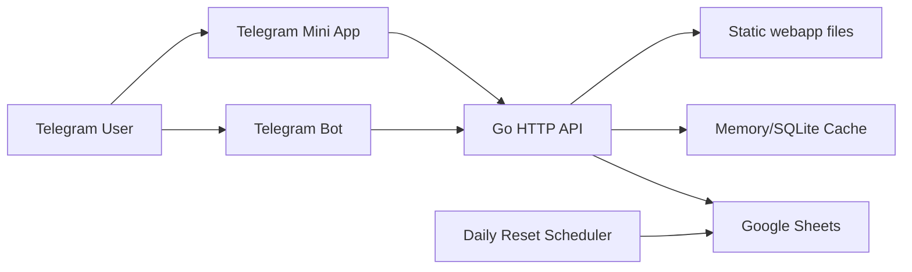

# Архитектура проекта

## 1. Контекст системы

`Wedding Bot` — это единый Go-процесс, который одновременно выполняет четыре роли:

1. HTTP API для Mini App.
2. Сервер статических файлов для собранного фронтенда.
3. Telegram-бот с long polling.
4. Планировщик ежедневных фоновых задач.

Внешние системы:

- Telegram Bot API
- Telegram WebApp runtime
- Google Sheets API
- локальное файловое окружение и SQLite-кэш

## 2. Контур компонентов

## 3. Модули backend

### `cmd/server`

Точка входа. Здесь:

- загружается конфиг;
- инициализируются кэши;
- проверяются и при необходимости восстанавливаются служебные листы Google Sheets;
- запускается API;
- запускается Telegram-бот;
- стартует планировщик `daily_reset`;
- поднимается HTTP сервер;
- выполняется graceful shutdown.

### `internal/config`

Отвечает за чтение env-переменных и значения по умолчанию. Конфигурация читается один раз на старте и используется всеми слоями.

### `internal/api`

Отвечает за:

- маршрутизацию;
- middleware;
- CORS;
- rate limiting;
- security headers;
- request id;
- structured logging;
- обработку `initData`;
- HTTP handlers для регистрации, игр, фото, тайминга и рассадки.

Особенность слоя: identity пользователя может быть восстановлена из нескольких источников:

1. `user_id` из запроса;
2. Telegram `initData`;
3. `username`;
4. подписанная auth-cookie.

### `internal/bot`

Telegram-бот обслуживает:

- старт и основное меню;
- fallback-потоки для гостя;
- админское меню;
- рассылки;
- игровые админ-команды;
- действия с группой;
- загрузку фото.

Слой бота не дублирует бизнес-логику хранения, а опирается на `google_sheets`.

### `internal/google_sheets`

Центральный доменный слой проекта. Здесь лежат:

- работа с Google Sheets API;
- создание обязательных листов;
- регистрация гостей;
- приглашения;
- игры и очки;
- тайминг;
- фото;
- рассадка;
- администраторы;
- словарь Wordle и кроссворды;
- key/value конфиг в листе `Config`.

Фактически это основной persistence-layer проекта.

### `internal/cache`

Используется для:

- краткоживущего in-memory кэша;
- кэша статистики;
- ускорения повторных запросов регистрации;
- хранения промежуточных соответствий `username -> user_id`.

### `internal/daily_reset`

Фоновый модуль ежедневного сброса активностей. Он должен:

- завершать игровой день;
- начислять частичную награду за незавершённые активности;
- переводить Wordle и Crossword на следующий цикл;
- быть идемпотентным в пределах дня.

## 4. Модули frontend

### `webapp-react`

Исходники Telegram Mini App.

Ключевые части:

- `src/App.tsx` — корневой контейнер вкладок.
- `src/contexts/UserContext.tsx` — восстановление identity пользователя.
- `src/contexts/RegistrationContext.tsx` — проверка факта регистрации.
- `src/utils/api.ts` — клиент API.
- `src/components/tabs/*` — пользовательские разделы.
- `src/components/games/*` — игровые механики.

### `webapp`

Собранный frontend bundle. Это deployable output Vite-сборки. Go-сервер раздаёт именно эту папку.

## 5. Основные пользовательские потоки

### 5.1 Идентификация пользователя

1. Mini App открывается в Telegram.
2. Frontend пытается получить `user_id` и `username` из `Telegram.WebApp`.
3. Если это не удалось, идёт fallback через локальный разбор `initData` и backend endpoint `/api/parse-init-data`.
4. Если пользователь открыт вне Telegram, возможен fallback через ручной `username`.
5. Backend может зафиксировать auth-сессию в cookie.

### 5.2 RSVP / регистрация

1. Frontend отправляет форму на `/api/register`.
2. Backend резолвит identity пользователя.
3. `google_sheets.AddGuestGroupToSheets` обновляет основного гостя и, если нужно, добавляет дополнительных гостей как отдельные строки.
4. Дополнительные гости привязываются к тому же auth-идентификатору владельца регистрации.
5. Подтверждение участия пишется в `Список гостей`.
6. Кэш регистрации обновляется.

### 5.3 Проверка регистрации

1. Frontend вызывает `/api/check-registration`.
2. Backend разрешает identity.
3. Проверка идёт по колонке идентификатора в `Список гостей` и учитывает все строки, связанные с владельцем регистрации.
4. Положительный результат кэшируется краткосрочно.

### 5.4 Игры

1. Гость запускает игру из вкладки `Challenge`.
2. Frontend забирает/сохраняет прогресс через API.
3. Wordle и Crossword хранят состояние отдельно от общего рейтинга.
4. После результативного действия рейтинг пишется в лист `Игры`.
5. Звание рассчитывается от суммарного счёта.

### 5.5 Фото

1. Фото может прийти из Mini App или из Telegram-бота.
2. В таблицу `Фото` пишутся timestamp, user_id, username, имя и payload/file id.

### 5.6 Рассадка

1. Клиент запрашивает `/api/seating/info`.
2. Backend читает опубликованную копию рассадки из листа `Рассадка_фикс`.
3. Данные возвращаются списком столов, где в каждой колонке лежит свой список гостей.
4. Кнопка `Обновить рассадку` в админ-панели перезаписывает `Рассадка_фикс` из текущего листа `Рассадка`.

### 5.7 Админ-операции

Через Telegram-бот доступны:

- управление гостями;
- рассылки;
- переключение игр;
- управление группой;
- работа с админами;
- исправление данных гостей;
- просмотр рассадки.

## 6. Контракт Google Sheets

Google Sheets в проекте не просто CMS, а часть доменной модели. Критично поддерживать совместимость колонок и смыслов.

Базовые листы и их ответственность:

- `Список гостей` — реестр гостей, подтверждение участия и Telegram-идентификатор.
- `Пригласительные` — исходная база приглашений и статусов отправки.
- `Игры` — агрегированная статистика и ранги.
- `Wordle*` — очередь слов, состояние и прогресс Wordle.
- `Кроссворд*` — банк кроссвордов и пользовательский прогресс.
- `Фото` — журнал загруженных фото.
- `Config` — глобальные переключатели и индексы ротации.

## 7. Сильные стороны текущей архитектуры

- Один исполняемый сервис без лишней распределённости.
- Прямая привязка к Telegram-сценариям.
- Быстрый редактируемый контент через Google Sheets.
- Есть fallback-механики идентификации для нестабильного WebApp окружения.
- Есть базовые защитные middleware и структурированное логирование.

## 8. Текущие архитектурные ограничения

- Google Sheets выполняет слишком много ролей и становится точкой хрупкости.
- Слабое тестовое покрытие на уровне доменных сценариев.
- Часть поведения игр размазана между frontend, API и таблицами.
- Много логики завязано на жёсткие имена листов и колонок.
- Есть зависимость от корректного Telegram identity даже в браузерном fallback-режиме.
- Долгое развитие может упереться в пределы управляемости Sheets-модели.

## 9. Рекомендованное направление эволюции

1. Стабилизировать доменные контракты и ежедневные игровые процессы.
2. Повысить тестируемость критических сценариев.
3. Уменьшить количество неявных правил в Google Sheets.
4. Позже вынести часть данных в нормальную БД, не ломая существующую операционную модель.
