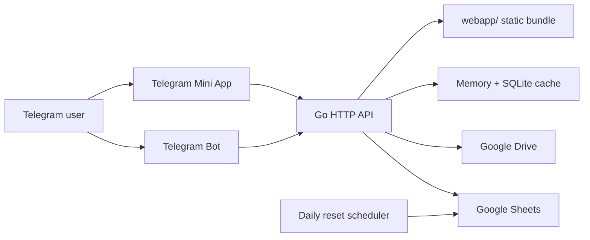

# Архитектура проекта

## 1. Контекст системы

Проект состоит из одного Go-процесса, который одновременно выполняет четыре роли:

1. HTTP API для Telegram Mini App.
2. Сервер статических файлов для собранного frontend bundle.
3. Telegram-бот с long polling.
4. Scheduler фоновых ежедневных задач.

Внешние интеграции:

- Telegram Bot API / Telegram WebApp
- Google Sheets API
- Google Drive API
- локальный memory/SQLite cache

## 2. Контур компонентов

## 3. Backend-модули

### `cmd/server`

Composition root приложения:

- загружает env/config;
- инициализирует cache;
- проверяет обязательные Google Sheets-листы;
- запускает API и Telegram-бота;
- стартует `daily_reset`;
- поднимает HTTP server;
- выполняет graceful shutdown.

### `internal/config`

Единая точка загрузки runtime-конфигурации:

- env loading из `.env.local` и `.env`;
- нормализация строковых секретов и идентификаторов;
- debug flag и runtime defaults.

### `internal/api`

Слой HTTP API и middleware:

- маршрутизация;
- CORS и security headers;
- request ID и structured logging;
- rate limiting;
- auth/session cookie;
- разбор и валидация Telegram `initData`;
- handlers регистрации, игр, фото, тайминга и рассадки.

Identity пользователя разрешается по следующему приоритету:

1. `user_id` из запроса;
2. Telegram `initData`;
3. `username`;
4. подписанная cookie-сессия.

### `internal/bot`

Telegram-бот отвечает за:

- стартовое меню и пользовательские команды;
- админские сценарии;
- рассылки;
- загрузку фото;
- действия с гостями и группой.

Слой бота не хранит бизнес-данные самостоятельно и опирается на `internal/google_sheets`.

### `internal/google_sheets`

Главный доменный persistence-слой:

- работа с Google Sheets API;
- регистрация гостей;
- приглашения и идентификаторы гостей;
- игры, прогресс и очки;
- тайминг и правила;
- фото/видео metadata;
- рассадка;
- Google Drive upload.

### `internal/cache`

Используется для:

- краткоживущего memory cache;
- кэша регистраций и username-to-user-id сопоставлений;
- SQLite-кэша игровой статистики.

### `internal/daily_reset`

Scheduler ежедневного reset игровых циклов. Модуль должен быть идемпотентным в пределах дня и безопасно переживать повторный запуск.

## 4. Frontend-модули

### `webapp-react`

Исходники Mini App:

- `src/App.tsx` — корневой UI контейнер;
- `src/contexts/UserContext.tsx` — восстановление identity пользователя;
- `src/contexts/RegistrationContext.tsx` — проверка регистрации;
- `src/utils/api.ts` — клиент API;
- `src/components/tabs/*` — пользовательские разделы;
- `src/components/games/*` — игровые сценарии.

### `webapp`

Собранный production bundle, который раздаётся Go-сервером. Это deployable output Vite-сборки.

## 5. Основные потоки

### Идентификация пользователя

1. Mini App получает `Telegram.WebApp`.
2. Frontend пытается восстановить `user_id` и `username` из `initDataUnsafe` или локального разбора `initData`.
3. Backend валидирует `initData`, при необходимости резолвит identity по `username`.
4. После успешного разрешения identity backend выставляет подписанную cookie-сессию.

### RSVP / регистрация

1. Frontend отправляет форму на `/api/register`.
2. Backend нормализует identity.
3. `google_sheets.AddGuestGroupToSheets` обновляет основного гостя и дополнительных гостей, а при наличии Telegram `user_id` повышает старые username-based строки до numeric ID.
4. Backend синхронизирует identity в листах `Список гостей` и `Приглашения`, затем обновляет registration cache и auth cookie.

### Фото / видео

1. Mini App присылает `multipart/form-data`, бот — Telegram media.
2. Backend загружает бинарные данные в Google Drive.
3. В лист `Фото` пишутся metadata, user identity и ссылка на файл.

### Игры

1. Frontend получает/сохраняет прогресс через API.
2. Доменные данные пишутся в Google Sheets.
3. Cache используется только как ускоритель, а не как source of truth.

### Рассадка

1. `/api/seating/info` возвращает опубликованную общую рассадку.
2. `/api/seating/personal` возвращает персональный стол пользователя по auth identity.

## 6. Production-инварианты

- `.env.local` не хранится в Git.
- В репозитории не должно быть локальных бинарников и Vite cache.
- `webapp/` и backend бинарник должны собираться из одной ревизии.
- `DEBUG=false` в production.
- Все входные точки проверяются через `go test`, `go test -race`, `go vet`, frontend lint/build и prod audit без runtime CVE.

## 7. Известные архитектурные ограничения

- Google Sheets остаётся главным operational datastore и точкой связанности.
- Доменные контракты листов завязаны на имена вкладок и структуру колонок.
- `lottie-web` даёт крупный frontend bundle и warning по `eval` на этапе сборки.
- Часть resilience пока опирается на defensive fallbacks, а не на строгие контракты данных.
